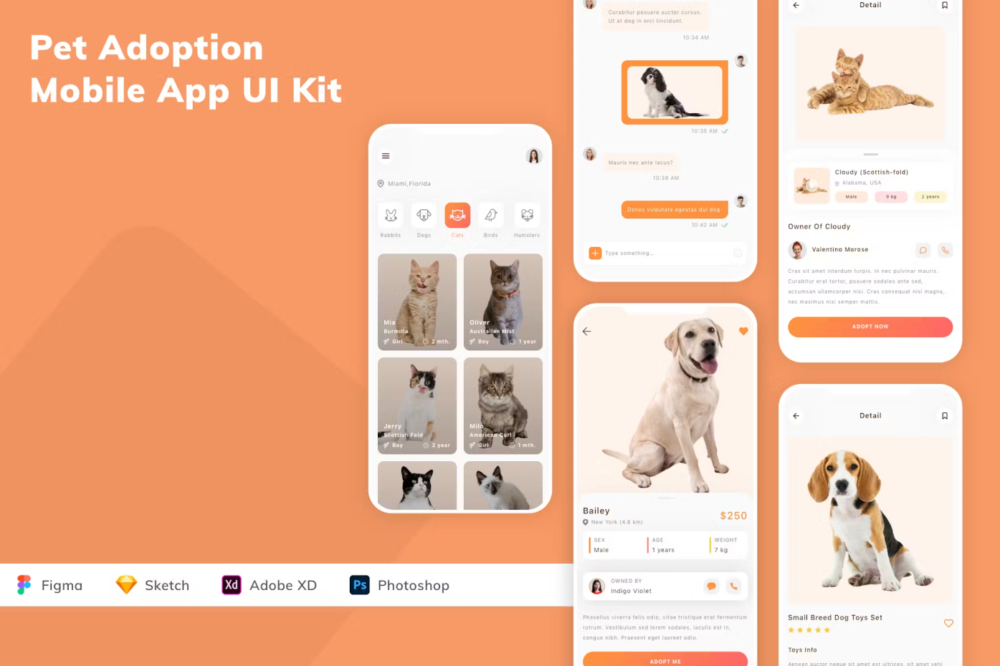

# Pet Adoption App Project

Welcome to the repository for our Pet Adoption App, a journey we're documenting from scratch to a fully functional, production-ready application. This project is developed using Flutter, showcasing raw, unscripted live coding sessions where we tackle real development challenges and share our behind-the-scenes process.

## Project Preview

## Live Coding Series on YouTube

Dive into the development process through our live coding series on YouTube. Each episode brings you closer to how we're building the Pet Adoption App, one line of code at a time.

- **Episode 1:** [Flutter Pet Adoption App: Live Coding #1 | Raw & Real](https://youtu.be/wvPf79lRgwg?si=ASis65g9kftA_mzT)

- Subscribe to our [YouTube Channel](https://www.youtube.com/@sutechsdev) for more episodes and videos.

## Getting Started

To get a local copy up and running follow these simple steps.

### Prerequisites

- Flutter installed on your machine
- An IDE (VSCode, Android Studio, or IntelliJ)

### Installation

1. Clone the repo
`git clone https://github.com/SuTechs/pet_adoption.git`
2. Navigate to the project directory
`cd pet_adoption`
3. Get Flutter dependencies
`flutter pub get`
4. Run the app
`flutter run`

## Contributing

Contributions are what make the open-source community such an amazing place to learn, inspire, and create. Any contributions you make are **greatly appreciated**.

1. Fork the Project
2. Create your Feature Branch (`git checkout -b feature/AmazingFeature`)
3. Commit your Changes (`git commit -m 'Add some AmazingFeature'`)
4. Push to the Branch (`git push origin feature/AmazingFeature`)
5. Open a Pull Request

## Social Media and Contact

- **Instagram:** [Follow us for daily updates](https://instagram.com/sutechs.in)
- **Our Website:** [Learn more about us and our projects](https://sutechs.in)

If you've got an idea and want to create or develop your app, reach out to us for app or website development services. We create beautiful websites and applications.

## License

Distributed under the [MIT License](LICENSE).

